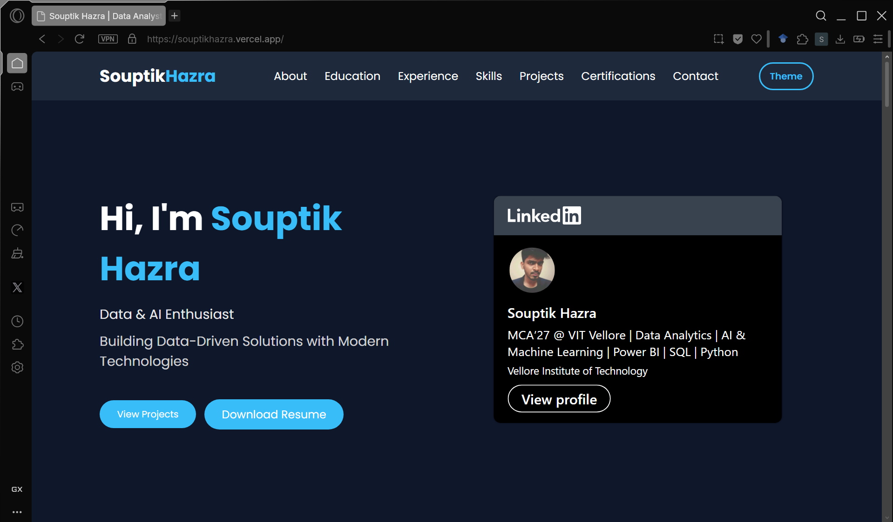
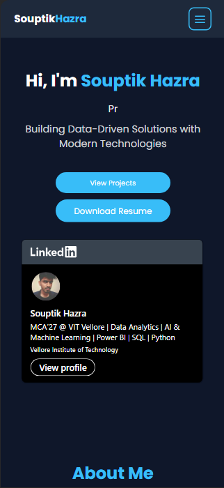

<div align="center">

# 🌐 Souptik Hazra Portfolio

### Data Analytics • Machine Learning • Data Engineering • Software Development

A modern, responsive portfolio website showcasing my projects, education, internship experience, technical skills, certifications, and professional journey.

<p>

<a href="https://souptikhazra.vercel.app">

</a>

<a href="https://github.com/Souptik-Hazra">

</a>

<a href="https://linkedin.com/in/souptik-hazra">

</a>

</p>

<p>


</p>

</div>

---

# 📑 Table of Contents

- 📖 About
- ✨ Features
- 🛠 Tech Stack
- 📷 Preview
- 📂 Project Structure
- 🚀 Getting Started
- 📊 Highlights
- 🎯 Project Overview
- 🚀 Deployment
- 📈 Repository Highlights
- 🔮 Future Enhancements
- 🤝 Connect With Me
- ⭐ Support
- 📄 License

---

# 📖 About

This repository contains the source code for my personal portfolio website.

The website is designed to showcase my education, internships, featured projects, technical skills, certifications, and resume through a clean, responsive, and recruiter-friendly interface.

Built with simplicity, accessibility, and performance in mind, it serves as a central place for recruiters, collaborators, and developers to explore my work.

---

# ✨ Features

- 🎨 Modern & Responsive UI
- 🌙 Dark & Light Theme
- ⚡ Smooth Scrolling Navigation
- ⌨️ Animated Typing Effect
- 💼 Internship & Experience Section
- 🎓 Education Timeline
- 🎯 Interactive Skills Section
- 🚀 Featured Projects Showcase
- 📜 Certifications Section
- 📄 Resume Download
- 📱 Mobile Friendly Design
- 🌐 Live Deployment on Vercel

---

# 🛠 Tech Stack

| Category | Technologies |
|-----------|--------------|
| Languages | HTML5 • CSS3 • JavaScript |
| Styling | CSS Grid • Flexbox • Responsive Design |
| UI/UX | Dark Theme • Light Theme • CSS Animations |
| Deployment | Vercel |
| Version Control | Git • GitHub |
| Automation | GitHub Actions |

---

# 📷 Preview

## 🎥 Portfolio Demo

<p align="center">

</p>

---

## 🖥 Desktop Preview

<p align="center">

</p>

---

## 📱 Mobile Preview

<p align="center">

</p>

---

# 📊 Highlights

| Category | Details |
|----------|---------|
| 🎓 Education | MCA @ VIT Vellore |
| 💼 Internship | AICTE Oasis Infobyte – Data Science Intern |
| 🚀 Featured Projects | 5+ |
| 📜 Certifications | 10+ |
| 💻 Technical Skills | 30+ |
| 📱 Responsive Design | Desktop & Mobile |
| 🌐 Deployment | Vercel |
| ⚡ Performance | Optimized |

---

# 📂 Project Structure

```text
My-Portfolio/
│
├── .github/
│   └── workflows/
│       └── deploy.yml
│
├── assets/
│   └── screenshots/
│       ├── demo.gif
│       ├── desktop.png
│       └── mobile.png
│
├── index.html
├── style.css
├── README.md
├── LICENSE
└── .gitignore
```

---

# 🚀 Getting Started

## Prerequisites

- Modern Web Browser
- Visual Studio Code (Recommended)
- Live Server Extension (Optional)

## Clone Repository

```bash
git clone https://github.com/Souptik-Hazra/My-Portfolio.git
```

## Navigate

```bash
cd My-Portfolio
```

## Run

Open

```text
index.html
```

or launch using **VS Code Live Server**.

---

# 🎯 Project Overview

This portfolio acts as a central platform to present my:

- 🎓 Education
- 💼 Internship Experience
- 🚀 Featured Projects
- 💻 Technical Skills
- 📜 Certifications
- 📄 Resume

The website is designed to provide recruiters, hiring managers, collaborators, and fellow developers with a concise overview of my academic and professional journey.

---

# 🚀 Deployment

| Platform | Status |
|----------|--------|
| Vercel | ✅ Live |
| GitHub Actions | ✅ Workflow Enabled |
| GitHub Releases | ✅ Versioned |

---

# 📈 Repository Highlights

- ✔ Responsive Design
- ✔ Mobile Optimized
- ✔ Semantic HTML
- ✔ SEO Friendly
- ✔ Accessibility Focused
- ✔ Performance Optimized
- ✔ Lightweight
- ✔ Clean Code Structure
- ✔ Modern UI/UX
- ✔ Production Ready

---

# 🔮 Future Enhancements

- 📈 Visitor Analytics Dashboard
- 📝 Blog Section
- 🔍 Project Search & Filtering
- 📬 Contact Form Backend
- 🌍 Multi-language Support
- 📱 Progressive Web App (PWA)

---

# 🤝 Connect With Me

<p align="center">

<a href="mailto:souptikhazra2003@gmail.com">

</a>

<a href="https://linkedin.com/in/souptik-hazra">

</a>

<a href="https://github.com/Souptik-Hazra">

</a>

<a href="https://souptikhazra.vercel.app">

</a>

</p>

---

# ⭐ Support

If you found this project useful, consider giving it a ⭐ on GitHub.

Your support helps increase the visibility of the project and motivates future improvements.

---

# 📄 License

This project is licensed under the **MIT License**.

See the **LICENSE** file for complete license information.

---

<div align="center">

## ❤️ Made with passion by Souptik Hazra

**Thanks for visiting!**

⭐ If you like this project, consider giving it a star.

</div>
